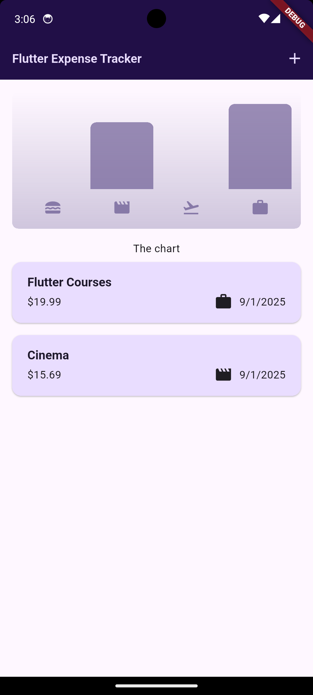
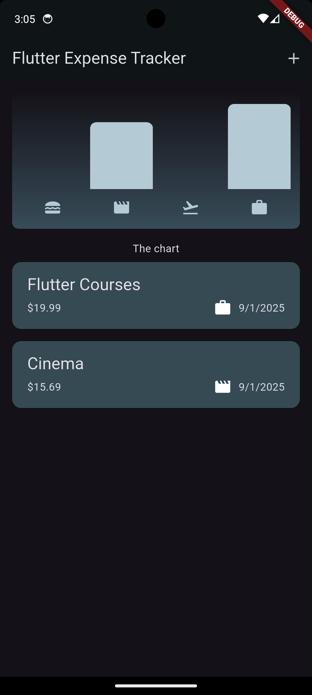

# 📊 Basic Expense Tracker

(Designed for educational purposes)
A simple personal expense tracking application built with Flutter.  
Allows users to add daily expenses and categorize them.

## 🚀 Features
- Add expenses
- View expense list
- Categorize expenses
- Simple and clean UI

## 📱 Screenshots

### Home Page (Light & Dark Theme)
<p align="center">
  
  
</p>

### Add Expense (Gif)
<p align="center">
  
</p>


## 🛠️ Built With
- Flutter
- Dart

## 🔧 Installation
Clone the project and run:
```bash
flutter pub get
flutter run


